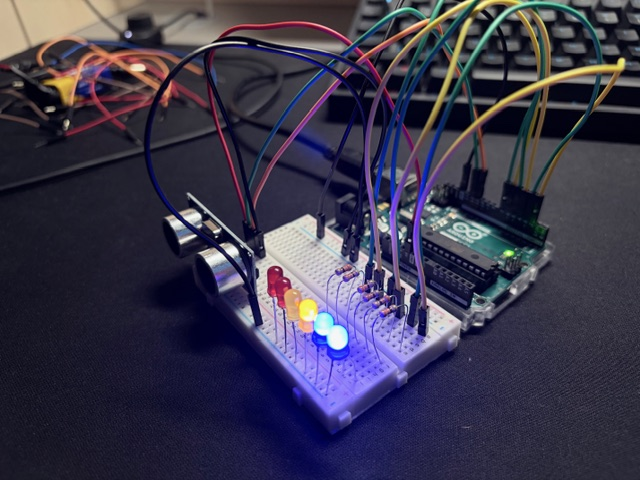

# Distance sensor

The project with distance sensor and six diodes to show the distance between sensor and object.

## Photo

## Required elements

* Arduino Uno connected to PC
* breadboard
* distance sensor HC-SR04
* red, yellow and blue diodes (each color 2x)
* resistor 330 Ohm 6x
* cables

## Code

Code file: distance-sensor.ino

