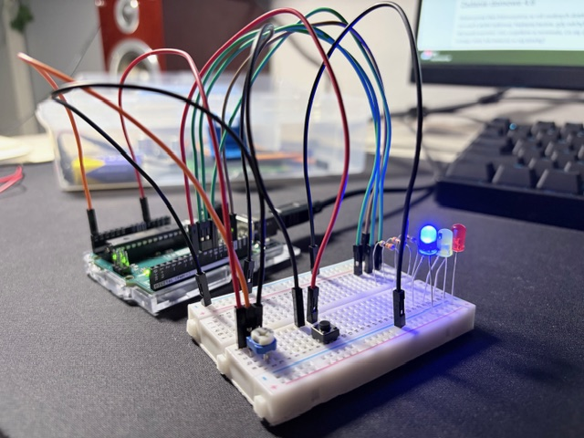

# Guess the potentiometer value game on Arduino

Simple game with diodes to show the actual state of the game.

## Photo

## Required elements

* Arduino Uno connected to PC
* 3x LED (red, yellow, green)
* 3x resistor 300 Ohm
* tact switch
* potentiometer
* breadboard
* cables

## Code

Code file: guess-the-potentiometer-value.ino

