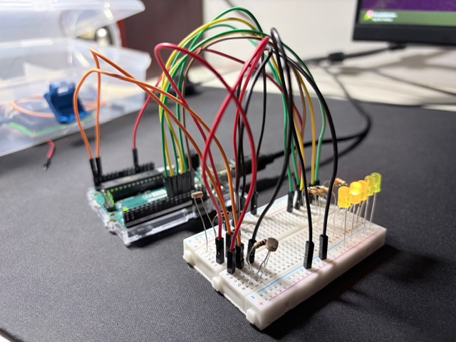

# Light detector on Arduino

A project that shows the direction of the light source on the diodes on Arduino.

## Photo

## Required elements

* Arduino Uno connected to PC
* breadboard
* 5x LED (same color)
* 5x resistor 300 Ohm
* 2x resistor 1 kOhm
* 2x photoresistor
* cables

## Code

Code file: light-detector.ino

