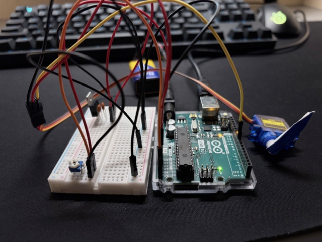

# Potentiometer-controlled servo

Project that allows you to control servo motor by potentiometer position.

## Photo

## Required elements

* Arduino Uno connected do PC
* 9V battery
* breadboard
* linear voltage regulator LM7805
* ceramic capacitor 2x
* servo motor
* potentiometer
* cables

## Code

Code file: servo-ptentiometer.ino

