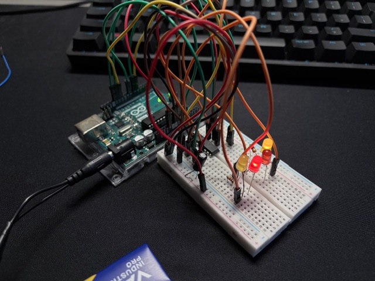

# Two engines simulation

The simulation of two DC motors working together and changing rotate direction. The color of the diode symbolizes direction, and its light intensity symbolizes rotation speed.

## Photo

## Required elements

* Arduino Uno connected to PC
* breadboard
* 9V battery
* red dides 2x, yellow diodes 2x
* resistors 1000 Ohm 2x
* H-bridge
* electrolycal capacitor
* cables

## Code

Code file: two-engines.ino

